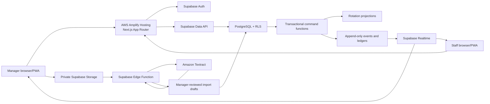
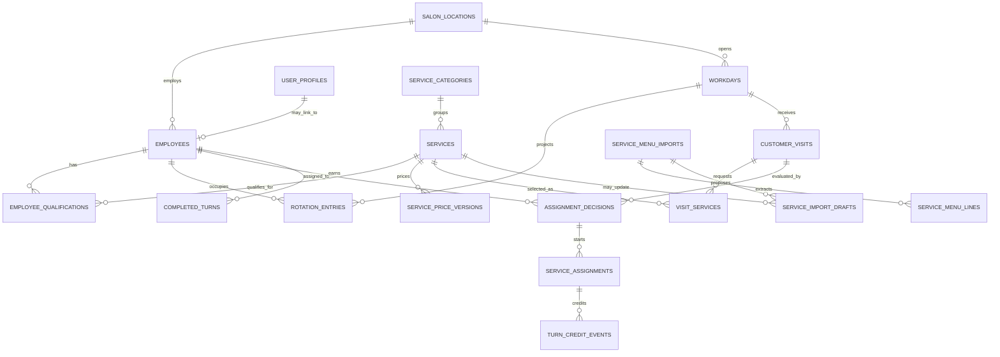
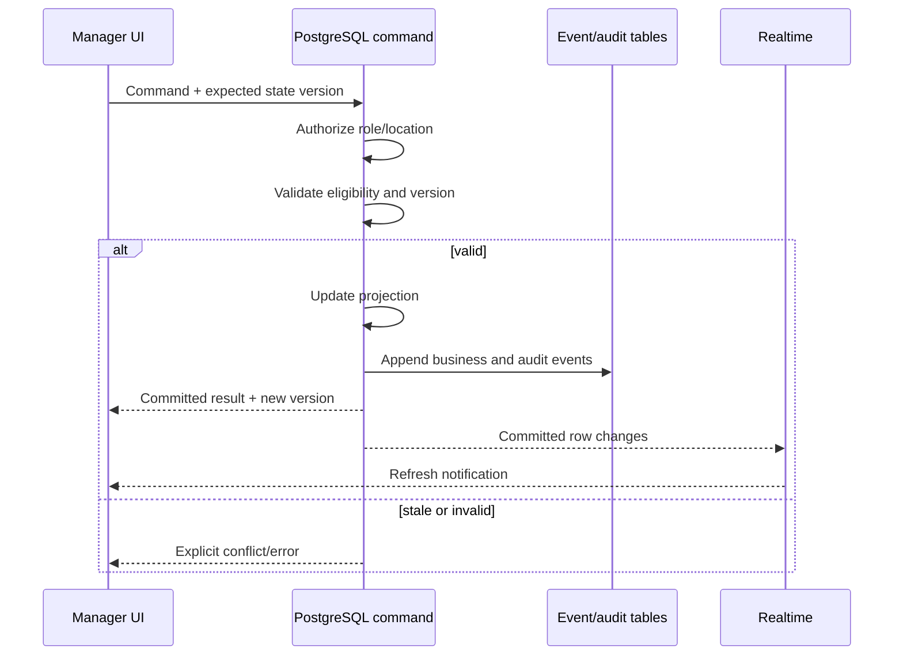

# System architecture

Turn Rotation keeps business rules in PostgreSQL transactions and uses the
Next.js application as a secure presentation and orchestration layer. Realtime
messages trigger refreshes; they never calculate or mutate rotation order.

## Trust boundaries

- The browser receives only the Supabase project URL and publishable key.
- Supabase RLS enforces role and location boundaries even if a client bypasses
  the user interface.
- Rotation-changing commands validate the expected state version and commit the
  projection, business events, and audit evidence atomically.
- AWS credentials and the Supabase secret key exist only in the Edge Function
  secret environment.
- Textract results remain inactive drafts until a manager confirms them.
- The service worker caches no authenticated HTML. Its offline snapshot contains
  aggregate counts only.

## Core entity relationships

The production schema contains additional command, audit, correction, and
integration tables. This diagram focuses on the relationships needed to explain
the central workflow.

## Command lifecycle

